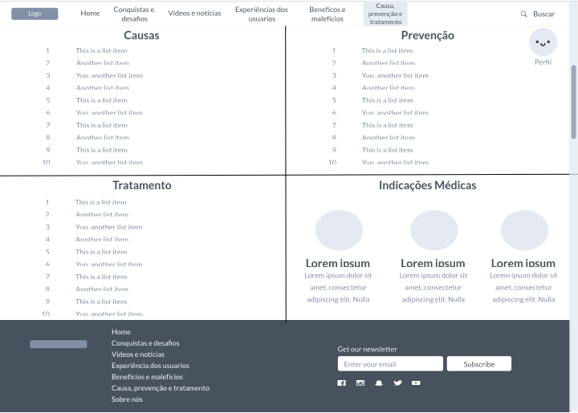

# Informações do Projeto
QuitVapingNow

Trabalho Interdisciplinar - Aplicações Web

`Ciências da Computação - PUC MINAS` 

## Participantes
> Inclua a lista dos membros da equipe com seus nomes completos.
>
> Os membros do grupo são: 
>- Arthur de Sá Camargo
>- Arthur Sgarbi Andrade
>- Felipe Campolina Soares de Paula
>- Pedro Gustavo de Castro Markiewicz
>- Rafael Lana Mascarenhas Diegues

# Estrutura do Documento

**[Introdução](#introdução)**

> [Problema](#problema) 
> 
> [Objetivos](#objetivos) 
> 
> [Justificativa](#justificativa) 
> 
> [Público alvo](#público-alvo) 

**[Especificação do Projeto](#especificação-do-projeto)**

> [Personas](#personas) 
> 
> [Histórias de usuários](#histórias-de-usuários) 
> 
> [Requisitos do Projeto](#requisitos-do-projeto) 
> 
> [Requisitos Funcionais](#requisitos-funcionais)
> 
> [Requisitos não funcionais](#requisitos-não-funcionais) 
> 
> [Restrições](#restrições) 

**[Metodologia](#metodologia)**

> [Relação de Ambientes de Trabalho](#relação-de-ambientes-de-trabalho)
> 
> 
> [Gestão de código fonte](#gestão-de-código-fonte) 
> 
> [Gerenciamento do Projeto](#gerenciamento-do-projeto) 

**[Projeto de Interface](#projeto-de-interface)**

> [Fluxo do Usuário](#fluxo-do-usuário) 
> 
> [Wireframes](#wireframes) 
> 
> [Tela - Login](#tela---login) 
> 
> [Tela - Página de registrar](#tela---página-de-registrar) 
> 
> [Tela - Questionário](#tela---questionário) 
> 
> [Tela - Inicial](#tela---inicial) 
> 
> [Tela - Conquistas e desafios](#tela---conquistas-e-desafios) 
> 
> [Tela - Videos e notícias](#tela---videos-e-notícias) 
> 
> [Tela - Experiências dos usuários](#tela---experiências-dos-usuários)
> 
> 
> [Tela - Benefícios e Malefícios](#tela---benefícios-e-malefícios) 
> 
> [Tela - Causas, prevenção e
> tratamento](#tela---causas-prevenção-e-tratamento) 
> 
> [Tela - Perfil](#tela---perfil) 
> 
> [Tela - Sobre](#tela---sobre) 
> 
> [Tela - Buscar](#tela---buscar) 

**[Referências Bibliográficas](#referências-bibliográficas)**

# 

# Introdução

O contexto contemporâneo é caracterizado pela velocidade e praticidade.
É notório que, a cada dia que se passa, a sociedade vem se adaptando
para inserir-se nesse ambiente, criando, modificando, destruindo e
transformando o mundo e os objetos nele presente.

Um exemplo dessa ideia, é criação de dispositivos eletrônicos para fumar
(DEF 'S), em uma tentativa de acelerar e aumentar a facilidade e a
usabilidade do hábito do tabagismo. A ideia de um “cigarro elétrico”
aparece pela primeira vez no ano de 1960, nos Estados Unidos,
desenvolvido e patenteado em 1963, por Herbert Gilbert, como um possível
substituto menos maléfico para os cigarros. Entretanto, no século XXI,
esse dispositivo se transformou, muitas vezes, numa porta de entrada
para o tabagismo, consequentemente, crescendo o número de pessoas
viciadas em nicotina, provocando dermatite, doenças cardiovasculares,
câncer e inúmeros outros malefícios à saúde.

Além disso, vale ressaltar o grande número de jovens e adolescentes que
estão usufruindo desses aparelhos, sendo assim ainda mais prejudiciais,
por causa do corpo humano em desenvolvimento. É possível perceber a
“febre” que os cigarros eletrônicos viraram internacionalmente, visto
que, diversos países e organizações sanitárias proibiram a venda e
comercialização, em uma tentativa de frear essa onda e proteger a saúde
dos cidadãos.

## Problema

Conforme exposto, muitos usuários acreditam que os cigarros eletrônicos
são menos maléficos do que os cigarros convencionais, justificando a
troca, dessa forma, sustentando o vício pela nicotina de uma maneira
“mais saudável”. Todavia, para combater a dependência é necessário a
busca de auxílio de profissionais de saúde, além da redução gradativa do
hábito de fumar.

## Objetivos

O objetivo geral deste trabalho é a criação de uma plataforma que
auxilia as pessoas que fumam cigarros eletrônicos a reduzirem este
hábito, visando a interrupção por completa dessa prática, assim
reduzindo a prevalência de fumantes e a consequente morbimortalidade
relacionada ao consumo de derivados do tabaco.

Como objetivos específicos, podemos ressaltar:

  - > Fornecer funcionalidades que permitam acompanhar o uso, por meio
    > de uma gamificação.

  - > Fornecer funcionalidades que permitam acompanhar a economia feita
    > ao cessar tal hábito.

## 

## Justificativa

Em estudo realizado pela Global Clinical Research Journal, é evidente
que os cigarros eletrônicos foram introduzidos na sociedade como um
substituto do cigarro tradicional, entretanto viraram, em muitos dos
casos, uma porta de entrada para o tabagismo . Além disso, é notório um
grande número de jovens seduzidos pela modernidade e particularidades
dos dispositivos, utilizando-os sem saber dos malefícios à saúde(DA
SILVA et al ; 2021). Adicionalmente, existe uma grande parcela de
pessoas que estão viciadas em DEF 'S, graças a presença de nicotina nos
mesmos.

Portanto, o trabalho foi desenvolvido para reduzir a predominância de
fumantes e a consequente morbimortalidade e danos à saúde relacionados
ao consumo de cigarros eletrônicos.

## Público alvo

Embora todas as pessoas possam se beneficiar da plataforma para se
informarem sobre dispositivos eletrônicos para fumar, considerados como
o novo cigarro do século XXI, a plataforma especificamente visa auxiliar
aqueles que pretendem parar de fumar.

Desta forma, estabeleceu-se como público-alvo desta solução as pessoas
que procuram interromper o hábito do tabagismo, ressaltando os jovens,
maioria dos usuários de DEF\`S, além de familiares e amigos de usuários
que estão preocupados com o uso excessivo.

#   

# Especificação do Projeto

Após o trabalho de imersão nos proporcionado, com foco em discutir e
debater problemas atuais, decidimos os membros da equipe responsável por
esse problema e seus pontos mais relevantes a serem tratados. Os
detalhes levantados nesse processo foram consolidados na forma de
personas e histórias de usuários.

## Personas

Nas figuras a seguir, são apresentadas as personas levantadas durante o
processo de entendimento do problema.

<table>
<thead>
<tr class="header">
<th></th>
<th><strong>Jorge Matheus Otoni</strong></th>
<th></th>
</tr>
</thead>
<tbody>
<tr class="odd">
<td></td>
<td>
<strong>Idade</strong>: 46

<strong>Ocupação</strong>: empresário, abriu uma empresa de agenciador de talentos e hoje trabalha com diversos pequenos e médios artistas pelo Brasil.
</td>
<td>
Aplicativos:

<ul>
<li><blockquote>

Instagram.

</blockquote></li>
<li><blockquote>

TikTok.

</blockquote></li>
<li><blockquote>

Twitter.

</blockquote></li>
<li><blockquote>

Linkedin.

</blockquote></li>
</ul></td>
</tr>
<tr class="even">
<td>
Motivações

<ul>
<li><blockquote>

Se tornar o maior agente de talentos do Brasil.

</blockquote></li>
<li><blockquote>

Juntar dinheiro suficiente para a educação de seus filhos.

</blockquote></li>
<li><blockquote>

Manter uma condição de vida alta para seus filhos.

</blockquote></li>
</ul></td>
<td>
Frustrações

<ul>
<li><blockquote>

Não consegui parar de fumar.

</blockquote></li>
<li><blockquote>

Dificuldade de realizar exercícios físicos.

</blockquote></li>
<li><blockquote>

É julgado sempre que o assunto é tabagismo.

</blockquote></li>
<li><blockquote>

Teme o risco de obter doenças pulmonares.

</blockquote></li>
</ul></td>
<td>
Hobbies, História

<ul>
<li><blockquote>

Viajar com a família.

</blockquote></li>
<li><blockquote>

Ir ao clube com os amigos.

</blockquote></li>
<li><blockquote>

Frequentar sua casa de campo aos finais de semana.

</blockquote></li>
</ul></td>
</tr>
</tbody>
</table>

<table>
<thead>
<tr class="header">
<th></th>
<th><strong>Gabriel Souza</strong></th>
<th></th>
</tr>
</thead>
<tbody>
<tr class="odd">
<td></td>
<td>
<strong>Idade</strong>: 18

<strong>Ocupação</strong>: Estudante Universitário de engenharia da computação. Frequenta faculdade particular.
</td>
<td>
Aplicativos:

<ul>
<li><blockquote>

TikTok

</blockquote></li>
<li><blockquote>

Instagram

</blockquote></li>
<li><blockquote>

Twitter

</blockquote></li>
<li><blockquote>

WhatsApp

</blockquote></li>
</ul></td>
</tr>
<tr class="even">
<td>
Motivações

<ul>
<li><blockquote>

Se formar na faculdade.

</blockquote></li>
<li><blockquote>

Construir uma família.

</blockquote></li>
<li><blockquote>

Adquirir sua independência financeira.

</blockquote></li>
</ul></td>
<td>
Frustrações

<ul>
<li><blockquote>

Já teve problemas de saúde relacionados ao seu vício.

</blockquote></li>
<li><blockquote>

Não conseguir controlar a ansiedade.

</blockquote></li>
<li><blockquote>

Dificuldade de controlar o vício em cigarros.

</blockquote></li>
<li><blockquote>

Medo de sentir-se excluído como consequência de seu vício.

</blockquote></li>
</ul></td>
<td>
Hobbies, História.

<ul>
<li><blockquote>

Ler livros.

</blockquote></li>
<li><blockquote>

Sair com amigos.

</blockquote></li>
<li><blockquote>

Andar de skate.

</blockquote></li>
</ul></td>
</tr>
</tbody>
</table>

<table>
<thead>
<tr class="header">
<th></th>
<th><strong>Pietra Silva</strong></th>
<th></th>
</tr>
</thead>
<tbody>
<tr class="odd">
<td></td>
<td>
<strong>Idade</strong>: 14

<strong>Ocupação</strong>: Estudante do ensino Médio . Frequenta escola estadual.
</td>
<td>
Aplicativos:

<ul>
<li><blockquote>

Tiktok.

</blockquote></li>
<li><blockquote>

Instagram.

</blockquote></li>
<li><blockquote>

Pinterest.

</blockquote></li>
<li><blockquote>

Twitter.

</blockquote></li>
<li><blockquote>

WhatsApp.

</blockquote></li>
</ul></td>
</tr>
<tr class="even">
<td>
Motivações

<ul>
<li><blockquote>

Ser uma jogadora de futebol.

</blockquote></li>
<li><blockquote>

Ter uma boa relação familiar.

</blockquote></li>
<li><blockquote>

Se tornar uma influenciadora digital de sucesso.

</blockquote></li>
</ul></td>
<td>
Frustrações

<ul>
<li><blockquote>

Seu irmão de 16 anos já é fumante.

</blockquote></li>
<li><blockquote>

Seu pai morreu devido a problemas com cigarro.

</blockquote></li>
<li><blockquote>

Ser rejeitada por diversos times de futebol.

</blockquote></li>
</ul></td>
<td>
Hobbies, História

<ul>
<li><blockquote>

Jogar bola.

</blockquote></li>
<li><blockquote>

Sair com os amigos.

</blockquote></li>
<li><blockquote>

Jogar videogame.

</blockquote></li>
</ul></td>
</tr>
</tbody>
</table>

## Histórias de usuários

As seguintes histórias de usuários foram registradas a partir da
compreensão do dia a dia das personas identificadas para o projeto.

<table>
<thead>
<tr class="header">
<th><strong>Eu como … [PERSONA]</strong></th>
<th><strong>… quero/desejo … 
[O QUE]</strong></th>
<th>
<strong>… para ....</strong>

<strong>[POR QUE]</strong>
</th>
</tr>
</thead>
<tbody>
<tr class="odd">
<td>Jorge Matheus Otoni</td>
<td>Parar com o uso dos cigarros em geral.</td>
<td>Devido ao conhecimento de que cigarros eletrônicos são tão prejudiciais à saúde quanto os cigarros convencionais.</td>
</tr>
<tr class="even">
<td>Jorge Matheus Otoni</td>
<td>Construir uma melhor relação familiar.</td>
<td>medo tornar-se uma pessoa excluída por sua própria família.</td>
</tr>
<tr class="odd">
<td>Jorge Matheus Otoni</td>
<td>Parar de mentir para as pessoas quando o assunto é cigarros.</td>
<td>não consegue admitir seu vício à seus amigos e familiares, prejudicando cada vez mais o processo de ajuda ao seu problema.</td>
</tr>
<tr class="even">
<td>Pietra Silva</td>
<td>Deixar sua mãe feliz e despreocupada.</td>
<td>a mãe de Pietra vive preocupada com o vício de seu irmão, devido a grande quantidade de tempo que ele pratica o uso de cigarros.</td>
</tr>
<tr class="odd">
<td>Pietra Silva</td>
<td>Ajudar seu irmão a parar de fumar.</td>
<td>Possui um irmão viciado em cigarros a muito tempo e passando por situações complicadas como consequência desse ato.</td>
</tr>
<tr class="even">
<td>Pietra Silva</td>
<td>Um futuro próspero para seu irmão.</td>
<td>Sabe das consequência do vício, uma vez que seu pai veio a falecer por causa disso..</td>
</tr>
<tr class="odd">
<td>Gabriel Souza</td>
<td>Parar de utilizar cigarros convencionais.</td>
<td>sente-se incomodado com o cheiro da fumaça.</td>
</tr>
<tr class="even">
<td>Gabriel Souza</td>
<td>Um Incentivo e uma ajuda para parar de fumar.</td>
<td>Teme por sua saúde pulmonar.</td>
</tr>
</tbody>
</table>

## Requisitos do Projeto

Por meio das obrigatoriedades que descrevem as possíveis interações
entre os usuários, o escopo funcional do projeto é definido. Além disso,
os requisitos não funcionais evidenciam os aspectos que o sistema deverá
apresentar de maneira geral. A seguir, são apresentados estes
requisitos.

### Requisitos Funcionais

A seguir está a tabela que aborda os requisitos do projeto, por meio da
identificação da prioridade em que esses devem ser entregues.

| **ID** | **Descrição**                                                                                                      | **Prioridade** |
| ------ | ------------------------------------------------------------------------------------------------------------------ | -------------- |
| RF-01  | O site deve apresentar um sistema de identificação dos usuários.                                                   | Média          |
| RF-02  | O site deve apresentar um sistema de acompanhamento do uso do usuário(página usuário) em gráficos e cards.         | Alta           |
| RF-03  | O site deve acompanhar os benefícios financeiros de não usar cigarros/DEF 's.                                      | Média          |
| RF-04  | O site deve oferecer um menu mobile.                                                                               | Média          |
| RF-05  | O site deve ter uma página que apresenta indicações de profissionais de saúde.                                     | Média          |
| RF-06  | O site deve possuir um sistema de recompensas, desafios e conquistas, a fim de incentivar o fim do hábito de fumar | Média          |
| RF-07  | O site deve possuir um questionário para identificar o perfil e vício do usuário.                                  | Média          |
| RF-08  | O site deve ter uma página com os malefícios do cigarro eletrônico.                                                | Baixa          |
| RF-09  | O site deve ter uma página vídeos e sobre o tabagismo.                                                             | Baixa          |
| RF-10  | O site deve permitir que usuários possam comentar suas experiências em relação ao site e abstinência.              | Média          |

### Requisitos não funcionais

Os requisitos não funcionais que o projeto deverá atender são
apresentados na tabela abaixo.

| **ID**  | **Descrição**                                                                                                 | **Prioridade** |
| ------- | ------------------------------------------------------------------------------------------------------------- | -------------- |
| RNF-01  | O site deve ser publicado em um ambiente acessível publicamente na Internet (Repl.it, GitHub Pages, Heroku);  | Alta           |
| RNF-02  | O site deverá ser responsivo permitindo a visualização em um celular de forma adequada.                       | Alta           |
| RNF-03  | O site deve ter bom nível de contraste entre os elementos da tela em conformidade.                            | Média          |
| RNF-04  | O site deve ser compatível com os principais navegadores do mercado (Google Chrome, Firefox, Microsoft Edge). | Alta           |
| RNF-05  | O site deve ter uma estética boa, a fim de atrair usuários.                                                   | Alta           |
| RNF -06 | O site deve ser uma experiência divertida para os usuários.                                                   | Média          |

### Restrições

Questões responsáveis pela limitação da execução do projeto e que se
configuram como obrigações evidentes para o desenvolvimento do projeto
em questão, são apresentadas na tabela a seguir.

| **ID** | **Descrição**                                                                                           |
| ------ | ------------------------------------------------------------------------------------------------------- |
| RE-01  | O projeto deverá ser entregue no final do semestre letivo, não podendo extrapolar a data de 03/07/2022. |
| RE-02  | O aplicativo deve se restringir às tecnologias básicas da Web no Frontend.                              |
| RE-03  | A equipe não pode subcontratar o desenvolvimento do trabalho.                                           |
| RE-04  | Falta de recursos financeiros para aprimorar recompensas.                                               |

# Metodologia

A metodologia exerce a função de contemplar as definições de ferramentas
utilizadas pela equipe. Nesse caso, ela é responsável tanto pela
manutenção dos códigos e demais artefatos quanto pela organização do
time na execução das tarefas do projeto.

## Relação de Ambientes de Trabalho

Os artefatos do projeto são desenvolvidos a partir de diferentes
plataformas. Na tabela a seguir, é apresentada pelos ambientes com seus
respectivos objetivos.

| **Ambiente**                      | **Plataforma** | **Link de Acesso**                                                                                                                                                                                                                          |
| --------------------------------- | -------------- | ------------------------------------------------------------------------------------------------------------------------------------------------------------------------------------------------------------------------------------------- |
| Repositório de código fonte       | GitHub         | [https://github.com/ICEI-PUC-Minas-PMGCC-TI/tiaw-pmg-cc-m-20221-uso-excessivo-de-cigarros-eletronicos](https://github.com/ICEI-PUC-Minas-PMGCC-TI/tiaw-pmg-cc-m-20221-uso-excessivo-de-cigarros-eletronicos) |
| Design Thinking                      | Miro           | [https://docs.google.com/folder/d/1xE9t6zD78VnVkeOSgDfss33QWe85ogqYpx9x-tuG24](https://docs.google.com/folder/d/1xE9t6zD78VnVkeOSgDfss33QWe85ogqYpx9x-tuG24)                                                 |
| Projeto de Interface e Wireframes | MarvelApp      | [https://marvelapp.com/4hd6091](https://marvelapp.com/prototype/175iab59)                                                                                                                                    |
| Gerenciamento de tarefas          | Trello         | [https://trello.com/b/BoOabyw9/tiaw-uso-excessivo-de-cigarros-eletronicos](https://trello.com/b/BoOabyw9/tiaw-uso-excessivo-de-cigarros-eletronicos)                                                         |

## Gestão de código fonte

Na figura a seguir, é apresentado um processo que tem como base o **Git
Feature Branch Workflow.** Esse, é utilizado pelo grupo para gestão do
código fonte do software desenvolvido pela equipe. De tal maneira,
todas as manutenções do código são realizadas em branches separadas. No
site, "[5 Git Workflows & Branching Strategy to
deliver better
code](https://zepel.io/blog/5-git-workflows-to-improve-development/)",
é encontrada uma explicação rápida sobre este processo.

Figura X - Fluxo de controle do código fonte no repositório git

## Gerenciamento do Projeto

A equipe utiliza metodologias ágeis, tendo escolhido o Scrum como base
para definição do processo de desenvolvimento.

A equipe está organizada da seguinte maneira:

  - > Scrum Master: Rommel Carneiro .

  - > Product Owner: Rafael Lana Mascarenhas Diegues.

  - > Equipe de Desenvolvimento
    
      - > Felipe Campolina Soares de Paula (Desenvolvedor Back End)
    
      - > Pedro Gustavo de Castro Markiewicz (Desenvolvedor Back End)
    
      - > Arthur Sgarbi Andrade (Desenvolvedor Back End)
    
      - > Arthur de Sá Camargo(Desenvolvedor Back End)

Para organização e distribuição das tarefas do projeto, a equipe está
utilizando o Trello estruturado com as seguintes listas:

  - > **Recursos**: A lista de recursos demonstra uma visualização de
    > tarefas usuais, utilizando configurações padronizadas que devem
    > ser seguidas pelo usuário. A ideia é utilizar a mesma interface
    > para ajudar na dinâmica da criação de novos cartões.

  - > **Backlog**: Recebe as informações a serem desenvolvidas e
    > representa o Product Backlog. Todas as interferências realizadas
    > no projeto também devem ser representadas nessa lista.

  - > **A fazer**: Esta lista representa o Sprint Backlog. Esse é o
    > atual sprint que está sendo desenvolvido pelo grupo.

  - > **Fazendo**: Quando uma tarefa for iniciada, movê-la para esse
    > tópico.

  - > **Teste**: Visão final sobre o projeto, checagem de funcionamento.
    > Quando o projeto estiver quase finalizado, realiza-se um teste
    > final para verificar o funcionamento dos recursos.

  - > **Feito**: Esse tópico apresenta as tarefas que passaram pelo
    > processo de testes e estão prontos para serem entregues para a
    > utilização dos usuários. Não há mais modificações ou observações a
    > serem realizadas.

O quadro kanban do grupo no Trello está disponível através da URL
[https://trello.com/b/BoOabyw9/tiaw-uso-excessivo-de-cigarros-eletronicos](https://trello.com/b/BoOabyw9/tiaw-uso-excessivo-de-cigarros-eletronicos)
e é apresentado, no estado atual, na Figura X. A definição desta
estrutura se baseou na proposta feita por Littlefield (2016).

Figura X - Tela do Trello utilizada pelo grupo

As tarefas foram divididas e etiquetadas nas seguintes categorias:

  - > Documentação

  - > Desenvolvimento

  - > Infraestrutura

  - > Testes

  - > Gerência de Projetos.

#   

# Projeto de Interface

Diante das preocupações para a montagem da interface no sistema, é
concedida uma maior ênfase em questões como agilidade, acessibilidade e
usabilidade. Para que ocorra um funcionamento em desktops e dispositivos
móveis, o projeto tem uma identidade visual padronizada em todas as
telas.

## Fluxo do Usuário

São evidenciadas as interações dos usuários pelas telas do sistema no
diagrama apresentado pela Figura X. Na seção de Wireframes a seguir, é
detalhada cada uma das telas desse fluxo. Para visualizar o wireframe
interativo, acesse o [ambiente MarvelApp do
projeto](https://marvelapp.com/prototype/175iab59/screen/86225823).

Figura X - Fluxo de telas do usuário

## Wireframes

De acordo com o fluxo de telas apresentado no item anterior, as telas do
sistema são detalhadas no item a seguir. Além disso, apresentam uma
estrutura comum que é apresentada na figura X. Nessa estrutura existem 3
grandes blocos descritos a seguir. São eles:

  - > **Cabeçalho -** local onde são dispostos elementos fixos de
    > identidade (logo) e navegação principal do site (menu da
    > aplicação);

  - > **Conteúdo -** apresenta o conteúdo da tela em questão;

  - > **Rodapé** - apresenta os elementos de navegação secundária,
    > geralmente associados aos elementos do bloco de conteúdo.

Figura X - Estrutura padrão do site

### 

### Tela - Login

A “Tela-Login” é onde o usuário da entrada no site. Nela, ele precisa
fazer o login com seu email e senha. Em caso de ainda não possuir uma
conta, ele pode, por meio do botão "registre-se", criar uma conta no
site. Em caso de esquecer a senha, o usuário pode tentar recuperá-la
clicando em “esqueceu a senha”.

Figura X - Página de login

### Tela - Página de registrar

Na “Tela - página de registrar” o usuário é capaz de criar uma conta
para ele no site. Para isso, é necessário inserir um email, uma senha, e
confirmar a senha. Em caso de já possuir uma conta, o usuário pode optar
pela opção “clique aqui” onde ele vai direto para a página de login no
site.

Figura X - Página de registar

### Tela - Questionário

Na “Tela-Questionário”, após o usuário se registrar no site, ele será
direcionado a essa página na qual ele responderá algumas perguntas com o
intuito de caracterizar sua personalidade e relação com os DEF´S.

Figura X - Tela - Questionário

### Tela - Inicial

A “Tela- Inicial” é o lugar onde o usuário terá acesso às principais
funcionalidades do site. A partir dela, ele pode acessar a página de
conquistas e desafios, vídeos e notícias, experiências dos usuários,
benefícios e malefícios e causa, prevenção e tratamento.

Figura X - Tela inicial - Home

### Tela - Conquistas e desafios

A “Tela- Conquistas e desafios”, possui duas partes, a de desafios e a
de conquistas. Na primeira, o usuário é motivado por meio de desafios a
serem cumpridos. Na segunda, fica representado suas conquistas
referentes aos objetivos cumpridos.

Figura X - Tela de Conquistas e Desafios

### Tela - Videos e notícias 

A “Tela- Vídeos e Notícias” é onde ficam armazenadas as notícias e
vídeos relacionados ao tema do site, combate aos DEF´S.

Figura X - Tela - Vídeos e notícias

### Tela - Experiências dos usuários 

A “Tela- Experiências dos usuários" é uma parte interativa onde os
usuários dos sites contam suas experiências relacionadas ao vício com o
uso de cigarros eletrônicos. Nela, os participantes são capazes de
conversar entre eles.

Figura X - Tela - Experiências dos usuários

### Tela - Benefícios e Malefícios 

Na “Tela- Benefícios e Malefícios” são apresentados os malefícios de
fumar e os benefícios de parar de fumar.

Figura X - Benéficos e Malefícios

### Tela - Causas, prevenção e tratamento

Na “Tela-Causas, prevenção e tratamento” estão abordadas as causas as
quais levam em geral os usuários a começarem a fumar, os modos de
prevenir que isso aconteça, além de maneiras de tratar e parar com esse
hábito. Também são apresentadas indicações médicas de locais para tratar
desse vício.

Figura X - Causas, prevenção e tratamento

### Tela - Perfil

Na “Tela- Perfil” é apresentado um resumo sobre o perfil do usuário,
mostrando suas principais características. Nela, estão presentes suas
informações, pessoas com quem interagiu e suas conquistas no combate ao
uso de DEF´S.

Figura X - Perfil

### Tela - Sobre

Na “Tela- Sobre” é apresentado um resumo a respeito do grupo criador do
site. Nela, estão presentes os principais objetivos do grupo, de onde
eles vieram, suas parcerias e quem são.

Figura X - Sobre

### Tela - Buscar

A tela "busca" foi feita com a finalidade de que o usuário ache todos os
conteúdos de forma mais simples e compacta na plataforma.

Figura X - Buscar

# Referências Bibliográficas

  - > Littlefield, A. **Guia da metodologia ágil e scrum para
    > iniciantes**. 2016. Disponível em:
    > [https://blog.trello.com/br/scrum-metodologia-agil](https://blog.trello.com/br/scrum-metodologia-agil).
    > Acessado em 15/04/2022.

  - > DA SILVA MACHADO BARRADAS, A.; OLIVEIRA SOARES, T.; BRANCO
    > MARINHO, A.; SOUSA DOS SANTOS, R. G.; IZIDIA ARAÚJO DA SILVA, L.
    > **Os riscos do uso do cigarro eletrônico entre os jovens** .
    > Global Clinical Research Journal, \[S. l.\], v. 1, n. 1, p. e8,
    > 2021. DOI: 10.5935/2763-8847.20210008. Disponível em:
    > https://www.globalclinicalresearchj.com/index.php/globclinres/article/view/15.
    > Acesso em: 16 abr. 2022.

  - > Knorst, Marli Maria et al. **The electronic cigarette: the new
    > cigarette of the 21st century?**\* \* Study carried out under the
    > auspices of the Graduate Program in Pulmonology, Federal
    > University of Rio Grande do Sul, and at the Porto Alegre Hospital
    > de Clínicas, Porto Alegre, Brazil . Jornal Brasileiro de
    > Pneumologia \[online\]. 2014, v. 40, n. 5 \[Acessado 16 Abril
    > 2022\] , pp. 564-572. Disponível em:
    > \<https://doi.org/10.1590/S1806-37132014000500013\>. ISSN
    > 1806-3756. https://doi.org/10.1590/S1806-37132014000500013.
